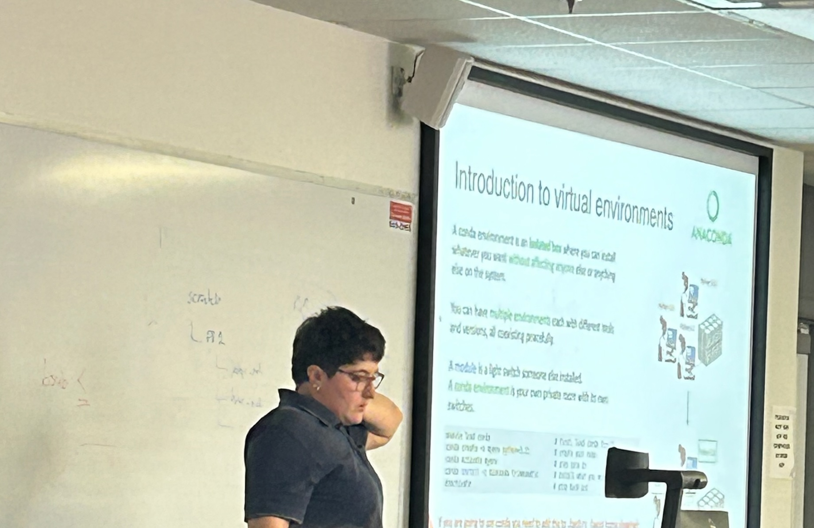

Getting started on NC State's Hazel cluster, from the command line to job submission. Taught as a recurring series from September 2025 to May 2026, plus a week-long intensive in May 2026.

{fig-alt="Mery teaching in front of a slide titled Introduction to virtual environments" group="photos"}

<!--
## Materials

- [Slides](https://...)
- [Workshop website / GitHub repo](https://...)
-->
