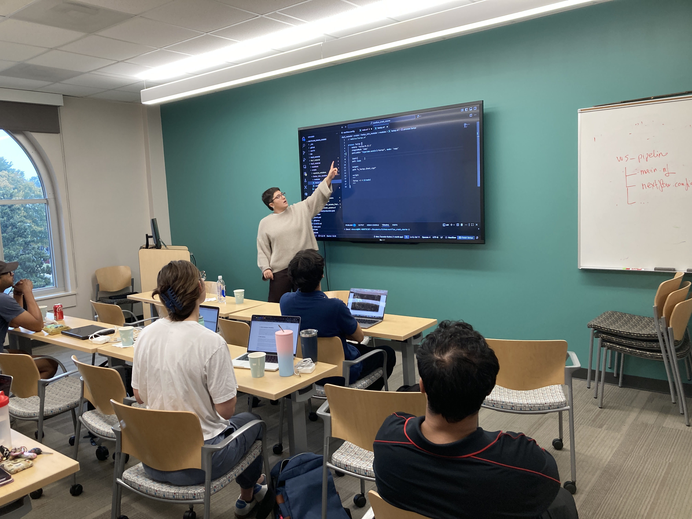
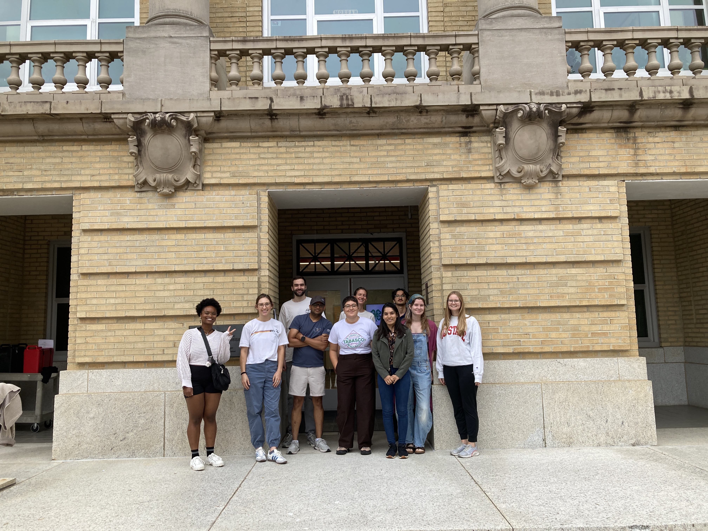

A hands-on Nextflow DSL2 crash course for people who are comfortable on the command line but new to Nextflow. I co-developed and teach it with Seth Weaver at the Bioinformatics Research Center, as part of my **Nextflow Ambassador (2026)** program. The materials are self-paced, so anyone can work through them.

- **Day 0, prerequisites:** getting onto the Hazel cluster, the filesystem, modules, SLURM jobs and Git
- **Day 1, fundamentals:** channels, processes, channel factories and operators, ending with a FastQC and trimming workflow
- **Day 2, production:** configuration, modular processes, containers and SLURM execution, with a genome assembly capstone

::: {layout-ncol=2}
{fig-alt="Instructor pointing to Nextflow code on a large screen while students follow along on laptops" group="photos"}

{fig-alt="Course participants posing for a group photo in front of a brick campus building" group="photos"}
:::

## Materials

- [Course website](https://hurwitzlab.github.io/nextflow_crash_course/)
- [GitHub repository](https://github.com/hurwitzlab/nextflow_crash_course)
