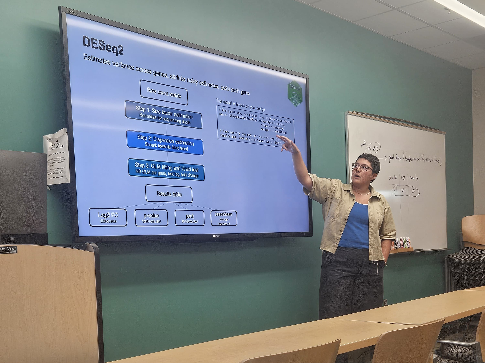
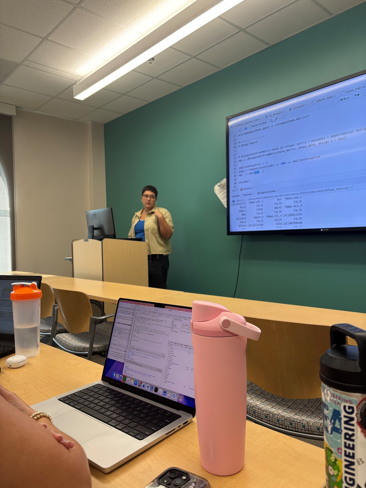

An introduction to omics data analysis in R, taught as two hands-on sessions at the Bioinformatics Research Center's **Bioinformatics Bonanza 2026**. Each session runs about two hours, and the materials are online so anyone can work through them.

- **Foundations of R with the Tidyverse:** R basics (objects, data types, vectors), the dplyr core verbs (`filter`, `select`, `mutate`, `arrange`, `summarize`), group operations and a first `ggplot2` plot, using the built-in `starwars` dataset
- **RNA-seq and Transcriptomics:** experimental design, the workflow from raw reads to a differential expression results table, and interpreting DESeq2 output

::: {layout-ncol=2}
{fig-alt="Mery pointing to a slide explaining the three steps of DESeq2" group="photos"}

{fig-alt="Mery presenting R code on a screen to a room of students with laptops" group="photos"}
:::

## Materials

- [Course website](https://hurwitzlab.github.io/omics_with_R/)
  - [Foundations of R with the Tidyverse](https://hurwitzlab.github.io/omics_with_R/r_tidyverse_workshop.html)
  - [RNA-seq and Transcriptomics](https://hurwitzlab.github.io/omics_with_R/rnaseq_workshop.html)
- [GitHub repository](https://github.com/hurwitzlab/omics_with_R)
