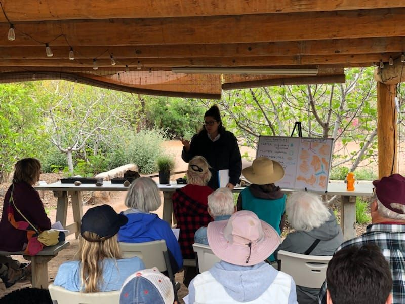

A community workshop on the microbes living in garden soil and why they matter for soil health.

<!--
Photos: put them in this folder and list them here. Click to enlarge.

::: {layout-ncol=2}

:::

## Materials

- [Slides](https://...)
- [Workshop website / GitHub repo](https://...)
-->
