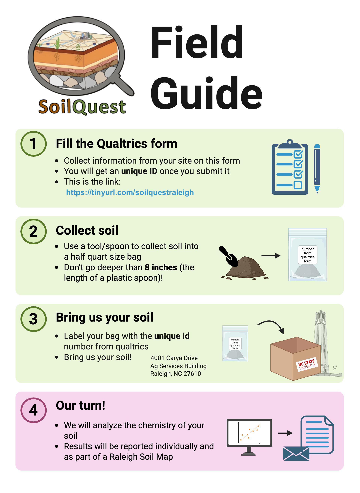

Soil Quest is a citizen science project to evaluate the health and quality of urban soils in Raleigh, North Carolina, and how they support ecosystems and environmental services. I co-lead it with Dr. Stephanie Mathews at NC State University, in partnership with SciStarter, NC State University Libraries and the Citizen Science Campus.

Participants pick a site in Raleigh, fill in a short online form, collect a small soil sample (half a quart, no deeper than 8 inches) and drop it off at NC State. We analyze the soil chemistry and send each participant their results by email. The data are also combined into a Raleigh soil map.

Thanks to Deanna Bigio and the Wake County Master Gardeners for helping launch the project.

{fig-alt="Soil Quest field guide with four steps: fill in the Qualtrics form, collect soil, bring the soil to NC State, and receive the chemistry results" group="photos"}

## Links

- [Project page on SciStarter](https://pages.scistarter.org/soil-quest/)
- [Sample collection form](https://tinyurl.com/soilquestraleigh)
